# FOC

## FOC简介

* FOC 磁场定向控制,也称为矢量控制,是目前无刷直流电机(BLDC)和永磁同步电机(PMSM)高效控制的最优方法之一. FOC旨在通过精准的控制磁场大小与方向,使得电机的运动平稳、噪声小、效率高,并且具有高速的动态响应.
* 简单的说,FOC是一种对无刷电机的驱动控制方法,他可以让我们对无刷电机进行"像素级"控制,实现很多传统电机控制方法所无法达到的效果.

## FOC驱动器与普通电调有什么区别.

1. FOC的优势
    * 低转速下控制 由于控制原理的区别,无刷电调只能控制电机在高转速下,低转速下很难控制;而FOC控制器则完全没有这个限制,不论在什么转速下都可以实现精确控制.
    * 电机换向 同上,由于无感电调无法反馈转子位置,因此很难实现电机正反转的换向;而FOC驱动器的换向性能极其优秀,最高转速下正反转切换可以非常流畅;此外FOC还可以能量回收的形式进行刹车控制.
    * 力矩控制 普通电调都只能控制电机转速,而FOC可以进行电流(力矩),速度,位置三个闭环控制.
    * 噪音 FOC驱动器的噪音会比电调小很多,原因是普通电调采用方波驱动,而FOC是正弦波.
2. 电调的优势
    * 兼容性 电调驱动不同的BLCD(无刷直流电机)不需要进行参数调整,而FOC需要.
    * 算法复杂度 电调的算法实现更简单,运算量少,很适合需要提高带宽的超高速电机.
    * 成本 电调的成本比FOC低很多

> **综上,FOC在控制性能上比电调强大的多,其优异的性能和磁场定向控制原理是密不可分的**

## 一些准备

### 1. 基础知识

#### 1. 电

* 左手定则 用于判断导线在磁场中受力的方向:伸开左手,使拇指与其他四指垂直且在一个平面内,(磁感线从N指向S,即手心面对N极)让磁感线从手心流入,四指指向电流方向,大拇指指向的就是安培力方向(即导体受力方向).
* 右手定则
  伸开右手,使大拇指与其余四个手指并且都和手掌在同一个平面内,把右手放入磁场中,让磁感线垂直穿入手心,大拇指指向导体运动方向,则其余四指指向感生电动势的方向.就是切割磁感线的导体会产生反电动势,实际上通过反电动势定位转子位置也是普通无感电调工作的基础原理之一.
* 右手螺旋定则(安培定则)
  用于判断通电线圈判断极性:用右手握螺线管,让四指弯向螺线管中电流方向,大拇指所指的呢端就是螺线管的N极.直流电流的磁场,大拇指指向电流方向,另外四指弯曲指的方向为磁感线的方向.
* PWM(脉冲宽度调制)
  高电平在周期中所占比例,叫占空比 利用PWM有实现使用离散的开关量模拟连续的电压值.

#### 2. 电机

* 无刷电机原理 参考下图<直流电机基本模型>,由磁极异性相吸同性相斥的原理,中间永磁体在两侧电磁铁的作用下会被施加一个力矩并发生旋转,这就是电机驱动的基本原理:

  

  对于简化的无刷电机来说,以三相二极内转字=子电机为例,定子的三相绕组有星形联结方式和三角联结方式,而三相星形联结的二二导通方式最为常用,如下图:

  

  如图,无刷电机三相的连接方式是每一相引出导线的一头,而另一头和其他相两两相连.这个情况下假如我们对A,B分别施加正电压和负电压,呢么由右手螺旋定则可以判断出线圈磁极的方向如下图:

  

  当转子和CO(O为中心点)连线平行时,磁铁会受到A,B两个磁极一推一拉的作用(此时转子受到的力矩最大),直到旋转到与AB连线平行且磁铁**内部磁力线**方向和AB间磁力线方向一致的时候,受合力矩为0且稳定,也就是上图右边的状态.即:**
  AB相通电会让转子转到上图中右边的状态**.C相此时暂时不起作用. 以此类推,可以得到每个通电状态下转子的角度,就是下图中的六个状态,每个状态相隔60度,6个过程即完成了完整的转动,共进行了6次换相:

  

  整个过程,旋转的磁场牵引着永磁体不断旋转.
  **而这个换向的操作,就是需要驱动器去完成的**
  这也就是无刷电机和有刷电机最大的区别,即不像有刷电机的机械换向,无刷电机是通过电子换向来驱动转子不断地转动,电机的电压和KV值决定了电机转速,而电机的转速就决定了换向的频率.

### 2. 关于BLDC和PMSM的区别

* 无刷电机其实可以分为**无刷直流电机(BLCD,航模上的呢种)**和**永磁同步电机(PMSM)**,结构大同小异,主要区别在于制造方式(绕圈绕组方式)不同导致的一些特性差异(比如反电动势的波形).
  从上面分析的刷电机模型其实可以看到,由于转子在磁场中只有6个稳定的状态,因此旋转过程中其实是不平滑的,存在扭矩的抖动,因此为了解决这个问题,从"硬件"和从"软件"出发有两个解决方案,这就衍生出了**BLDC**和**PMSM**的区别.
  简单的说,BLCD由于反电动势接近梯形波,所以肯定会有上面说的抖动问题,但是转一圈抖6下太明显了,如果增加电机槽、极对数(也就是磁铁对数),那以前是360度里面抖6下,现在变成120度里面抖6下,甚至更小,这样"颗粒感"
  就会变小.实际中买到的BLDC电机基本都是**多极对**的,原理图跟之前的分析是一样的,出来的都是三相信号,BLDC也可以结合抗齿槽算法的FOC进行力矩补偿实现平滑控制.

  

  另一方面,PMSM的反电动势被设计为正弦波的形状(放弃了方波这种不平滑的波)
  .我们用软件和算法结合PWM技术将方波转变成等效的SPWM正弦波或者SVPWM马鞍波,再来驱动电机,结果很好控制效果也很理想.当然为了产生更好的波形、更好的旋转磁场,驱动器、控制算法就变得非常复杂,**
  这也是FOC的实现原理,在后文会有介绍**

### 3. 驱动电路实现

#### 三相逆变电路

* 无刷电机的驱动电路主要使用三相逆变电路来实现,如下图:

  

  所谓逆变电路,即把直流电变为交流电,或者简单的说就是可以产生一个不同电流流向的电路,通过前面的电机模型分析我们也可以看出,对于无刷电机的驱动是需要在不同时刻施加不同方向的电压(电流)的,因此需要逆变电路.
  而逆变电路具体的实现则一般是采用**半桥MOS电路**来制作的.半桥电路的原型很简单,就是两个MOS管组成的上桥臂和下桥臂,中间引出一条输出线:

  

  用三个半桥电路就可以组成三相逆变电路,每个半桥引出的一根输出线跟无刷电机的一根相线相连,就完成了最基本的五刷驱动电路.
* 原理 MOS管可以看作电压控制的高速电子开关,在MOS管的栅极施加高电平或者低电平,就可以控制MOS源极和漏极的导通或者关闭.如下图,我们打开第一组半桥的上桥臂,第二组和第三组的下桥臂(其余的关闭)
  ,呢么就可以让电流从电源正极流过电机的a相,流经b,c相,然后回到电源负极:

  

  通过控制三个半桥的不同开关转态,就可以控制电流的电流中的不同流向.

> ps:在这个电路中,每个状态下电机的三相线圈都会有电流;驱动原理和之前分析一致,但是可以产生更大的扭矩.

将半桥电路的状态做一个编码首先限定一个半桥只有两种状态:

* 上桥开通下桥关断定义为状态1
* 上桥关断下桥开通定义为转态0 这样,三组半桥就一共有8种组合方式,编码分别为:**000,001,010,011,100,101,110,111**;

### 4. 旋转的三相电机波形

按照前面的无刷电机基本模型,假设我们拿到这样一个电机,手动匀速转动它的转子,然后用示波器观察它的三相输出电压(反电动势产生的电压),则会看到这样的波形:
三根正弦曲线,且三根曲线两两相位差为120°:

实际上三相发电机的原理就是这样,输出的就是三相幅值为220V的交流电(线电压为380V,即√3*220V). 所以反够来在三相无刷电机的三相线圈上输入上述三相正弦电压,就可以驱动无刷电机平稳高效的旋转了.
这也是FOC驱动无刷电机的基本手段,即**通过计算所需电压矢量,使用SVPWM技术产生调试信号,驱动三相逆变电路,合成出等效的三相正弦电压驱动电机**.

## FOC控制原理

### 1. FOC的Pipeline

下图是FOC控制流的整流程图景:

上图以电流闭环控制为例,也就是让电机始终产生一个恒定的力矩(也就是恒定的电流,因为力矩和电流成正比).

可以看到控制器的输入是最左边的Iq_reF和Id_reF,两个变量经过PID控制器进行反馈调节,其中还涉及到几个变换模块,有**park变换**和**Clark变换**;最后通过前面提到的**SVPWM模块**
作用到三相逆变器上进而控制电机;而PID控制器的反馈量,是对电机输出电流的采样值.

**概括,FOC控制的整个过程如下:**

1. 对电机三相电流进行采样得Ia,Ib,Ic
2. 将Ia,Ib,Ic进过Cliark变换得到Iα,Iβ
3. 将Iα,Iβ经过Park变换得到Iq,Id
4. 计算Iq,Id和其设定值Iq_reF,Id_reF的误差
5. 将上述误差输入两个PID(只用到PI)的控制器,得到输出的控制电压Uq,Ud
6. 将Uq,Ud进行反park变换得到Uα,Uβ
7. 用Uα,Uβ合成电压空间矢量,输入SVPWM模块进行调制,输出该时刻三个半桥的状态编码值
8. 按照前面输出的编码值控制三相逆变器的MOS管开关,驱动电机
9. 循环上述步骤

### 2. Clark变换和Park变换

如果要平稳的驱动三相电机转动,我们需要生成三个相位差120度的正弦波,
**但是我们最终的控制对象是MOS管的开通和关断**,只有**电压最大值和0值**两个状态,所以用前面提到的PWM技术,所谓SPWM就是如此:

观察上图,用上面坐标系中的正弦波和三角波的交点投影到下面的坐标轴,以此确定PWM的占空比变换规律,这样合成的PWM波,经过低通滤波器之后,其实就等效为了一个正弦波,所以SPWM就是在PWM的基础上用正弦波来调制合成的具有正弦波规律变化的方波.
**不过SPWM调试方式在FOC实现中并不常用,因为SPWM要比后面说的SVPWM的母线电压利用率低15%**

**另一方面,从控制的角度来看,我们甚至根本就不想用三个正弦波**

因为要**对于非线性的信号进行准确控制就要使用复杂的高阶控制器**,这对于建模成本、处理器算力、控制实时性等都是不利的.简单的说就是,**控制器的反馈输入变量是三个电流采样值,要稳稳的跟踪三个正弦波太麻烦了,可以简单点跟踪一条直线(常量)(
引用一点数学知识)**

* ### Clark变换
  回到上面FOC控制过程9个步骤的第一步,也就是对三个相电流进行采样,这一步会使用串联的采样电阻(Shunt)进行电流采样.
  > 由于电机工作的电流一般很大,所以采样电阻的阻值非常小,甚至和导线的电阻接近,因而实际的采样电路PCB设计的时候还有一些讲究,比如使用**开尔文接法**.

  但是我们实际电路设计时可以不使用三个采样器(实际有单采样电阻、双采样电阻和三采样电阻接法),只需要两个就够了.因为**基尔霍夫电流定律(KCL)**,在任一时刻,流入节点的电流之和等于流出节点的电流之和,也就是说:
  `Ia + Ib + Ic = 0`
  只需要知道其中两个就可以计算出第三个. 这三个电流基本上就是三个相位差120度的正弦波,在把这些信号输入控制器反馈控制之前,普及一点数学知识. 我们知道三相坐标系(Ia,Ib,Ic)如下:

这是一个二维平面内的坐标系,为什么要用三个坐标轴来表示呢?

而且很明显(Ia,Ib,Ic)这三个基向量是非正交的,我们可以做一个很简单的基变换将其正交化为一个直角坐标系,我们把新的直角坐标系命名为α-β坐标系,变换公式如下:

**其实就是个很简单的坐标轴投影计算,写成矩阵形式如下:

于是我们就回到直角坐标系了,变换后的波形如下:

可以看到变换后其实还是正弦波,只不过我们少了一个需要控制的变量了,现在只需要控制Iα,Iβ这两个变量,让其满足上图的下面的波形变化规律就可以控制电机旋转了,频率还是不变的.

> 注意这里的Iα,Iβ是我们虚拟出来的变量,所以在计算出一组Iα,Iβ后,我们通过上述公式的反向变换公式变换回去再应用到电机的三相上.

如果只是为了减小一个控制变量那这个**变换/反变换**操作显然有点多此一举.

有趣的是我们还可以接着变换:虽然α-β坐标系下少了一维变量,但是新的变量还是非线性的(正弦),Park变换可以把它们线性化.

* ### Park变换
  这一步中我们接着Clark变换将α-β坐标系旋转θ度,其中θ是转子当前的角度,如下图:

  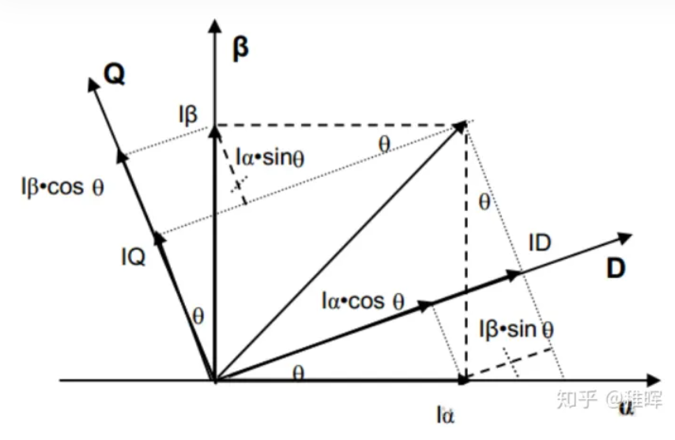

  变换公式:

  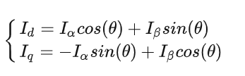

  写成矩阵形式:

  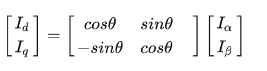

  这个操作是可行的,因为我们会通过编码器输入转子的实时旋转角度,所以这个角度始终是一个已知数.经过这一步的变换,我们会发现,一个匀速旋转向量在这个坐标系下变成了一个定值!(因为参考系相对于该向量静止了)
  ,这个坐标系下两个控制变量都被线性化了!

  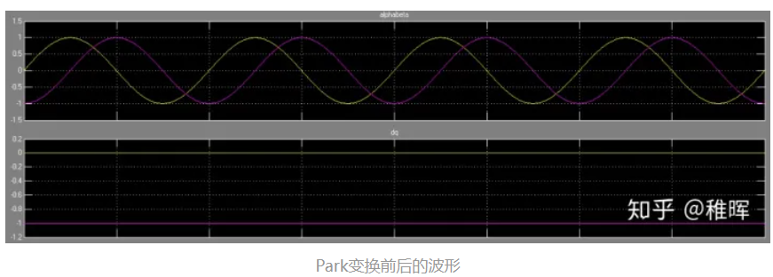

  接下来如果我们以Iq,Id这两个值作为反馈控制的对象,呢么显然就可以使用一些线性控制器来进行控制了,**比如PID**(尽管学术界有很多炫酷的高级控制方法,但是工业界还是偏爱PID).

至此已经理解完上面**FOC控制过程9个步骤**的前三步了.

### 3. PID控制

**PID(比例,积分,微分)**控制(基础), 在FOC控制中主要用到三个PID环,从内环到外环依次是:电流环、速度环、位置环. 也就是说:我们**通过电流反馈来控制电机电流(扭矩)**--->**然后通过控制扭矩来控制电机的转速**
--->
**再通过控制电机的转速控制电机位置**.

其中最内环的电流换控制框图如下:

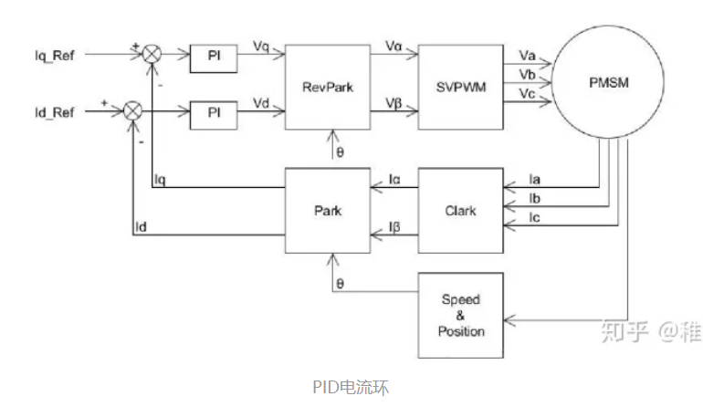

可以看出来,这也就是前面提到的FOC控制9个步骤所描述的过程.实际只用到了PI控制,没有引入微分,因为如果推导一下电压和电流的传递函数会发现这其实是一个一阶惯性环节(
而且实际上我们可以通过零极点对消化掉PI参数,只需要控制一个参数即电流带宽即可).
> 上图中的speed&Position模块可以是编码器,或者霍尔传感器等能感应转子位置的传感器.

特别说明一下其中Iq,Id,Iq_reF,Id_reF,前两者大家知道是通过`Clark变换`和`Park变换`得到的,而后两者是我们预期希望前两者达到的值,这个值具体代表了什么物理量?参考一下下图:

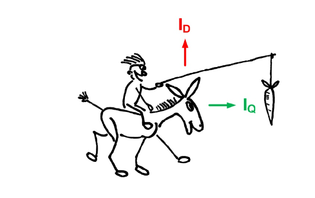

也就是说一通操作将转子磁链进行了解耦,分解为了旋转的径向和切向这两个方向的变量:

* 其中Iq是需要的,代表了期望的力矩输出
* 而Id是不需要的,我们希望尽可能它控制为0

  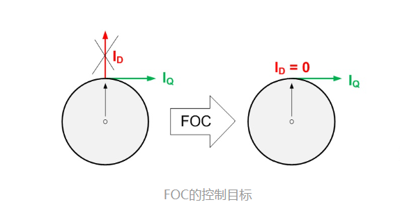

通过PID控制器使用上述输入(电流采样值、编码器位置)和输出(MOS管开关状态)完成对电机电流的闭环控制. 然后进入到下一层的速度环:

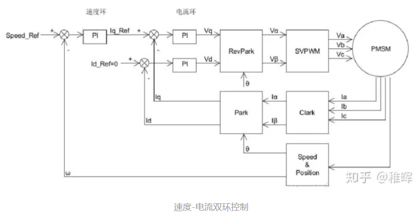

在上图中, Speedref是速度设定值,ω是电机的转速反馈,可以通过电机编码器或者霍尔传感器等计算得到,依然是使用**PI控制**.

将计算得到的电机速度ω与速度设定值Speed<sud>ref进行误差值计算,带入速度PI环,计算的结果作为电流环的输入,就实现了速度-电流的双闭环控制.
最外一层是位置环,也就是可以控制电机旋转到某个精确的角度并保持,控制框图如下:

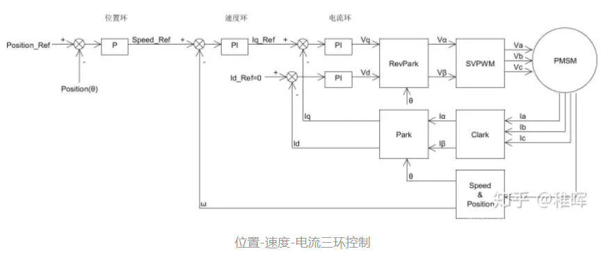

同理应该很简单可以理解,上图中位置控制PID只用了P项(也可以使用PI). 在实际使用中,由于编码器无法直接返回电机转速ω,因此可以通过计算一定时间内的编码值变化来表示电机的转速(也即用**平均速度**代表**瞬时速度**)
.当电机转速比较高的时候,这样的方式是可以的;但是在位置控制的时候,电机的转速会很慢(因为是要求转子固定在某个位置).这时候用平均测速法会存在非常大的误差(转子不动或者动的很慢,编码器就没有输出或者只输出1,2个脉冲).
所以为了避免速度环节带来的1误差,在做位置控制的时候可以只使用位置和电流组成的双环进行控制,不过此时需要对位置环做一定的变化,控制框图如下:

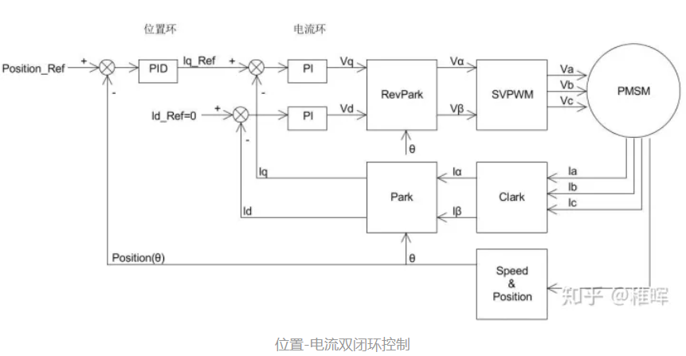

由于去掉了速度环,这里的位置环我们使用完整的**PID控制**,即把微分项加上(因为位置的微分就是速度,这样可以减小位置控制的震荡加快收敛;积分项的作用是为了消除静态误差).
**至此整个控制回路基本上清除了**,但是还有一些细节,就是上面框图中的`SVPWM模块`.

在整个控制流程图里面有 `park变换`和对应的 `反park变换`,但是却没有 `clark变换`对应的 `反clark变换`.取而代之的是一个 `SVPWM模块`.

#### 4. 空间电压矢量

空间电压矢量是我们在控制电机过程中虚拟出来的一个矢量,既然是矢量,自然是有大小和方向的,呢么它的大小和方向是什么呢? 以之前**三相逆变驱动电路**图中的状态为例,输入100的转态:

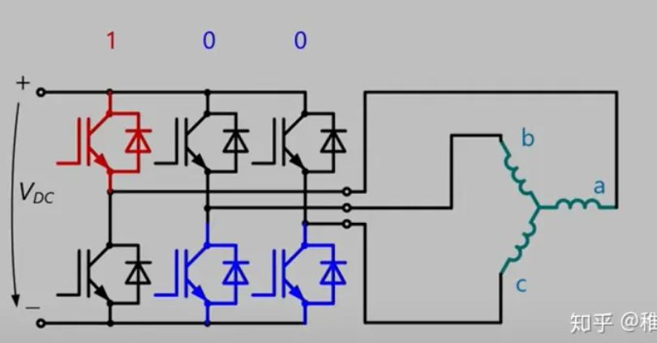
此时等效电路如图:

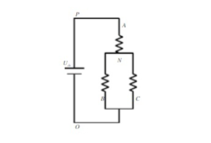

因此电机中的三个**相电压**(相电压是每相相对于电机中间连接的的电压)可以表示为:

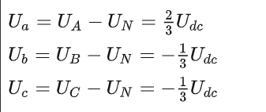

> 其实就是个最简单的分压电路,其中Udc是母线电压,也就是电源电压.

如果我们规定指向中心的方向为正,反之为负,呢此时我们可以画出下图中三个电压矢量Ua,Ub,Uc(左边),以及他们的合成电压矢量$\vec{U}$(右边):

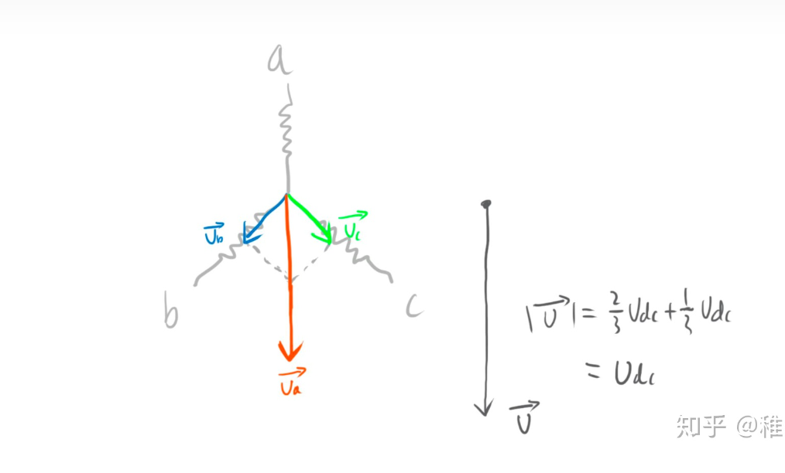

也就是说,这个状态下我们可以认为电机中存在一个矢量U表征的电压(电流);然后根据右手螺旋定则,可以判断出磁场的磁力线方向,也是和矢量U一致的. 再结合前面所说,转子永磁体会努力旋转到内部磁力线和外部磁场方向一致,**
所以这个矢量其实就是可以表征我们希望转子旋转到的方向,也即所需要生成的磁场方向**,而这个矢量是会不断在空间中旋转的,它的幅值不变,为相电压峰值Udc,且以角速度ω=2πf匀速旋转.

SVPWM算法的目的,就是使用三相桥的开关状态把空间中旋转的矢量表示出来,我们把这个矢量称为**空间电压矢量**. 用数学公式来表示:

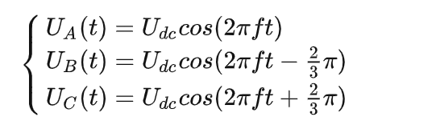

为了研究各相上下桥臂不同开关组合时逆变器输出的**空间电压矢量**,我们定义开关函数Sx(x∈a,b,c)为:

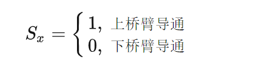

上桥臂导通下桥臂导通
(Sa,Sb,Sc)的全部可能组合共有8个,包括6个非零矢量:
U1(001),U2(010),U3(011),U4(100),U5(101),U(110)
和两个零矢量:
U0(000),U1(111)
可以看出零矢量状态下电机三相电压都为0不产生转矩(不考虑反电动势). 下面以其中一种开关组合为列分析,假设Sx=U4(100),也即这张图中的转态:

如前文分析,此时的电压矢量为AO方向,大小为Udc,将这个矢量画在坐标轴中如图:

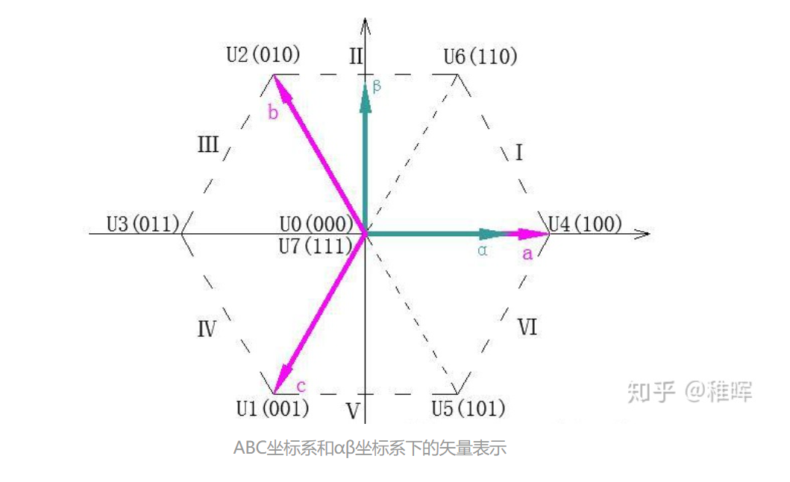

> 上图中(100)矢量方向和AO方向是相反的(变成OA)方向,这和正方向的定义有关,这样的规定更直观一些.
> 同时可以看到两个零矢量其实和原点重合了,因为这两个状态下电机中产生力矩的磁场为0(不考虑旋转过程中的反电动势产生的阻力力矩)

同理,上图中还可以看出其余5个空间电压矢量,它们的端点组成了一个六边形,同时把平面划分成了六个扇区(即图中的Ⅰ,Ⅱ,Ⅲ,Ⅳ,Ⅴ,Ⅵ)
**呢么由这6个空间电压矢量只能产生6个反向的力矩,如何产生任意方向的力矩?

#### 5. SVPWM

既然是"矢量控制",当然是有办法的,**使用这6个空间电压矢量作为基向量来合成任意矢量**.在每一个扇区,选择相邻两个电压矢量及零矢量.按照**伏秒平衡原则**来合成每个扇区内的任意电压矢量,即:

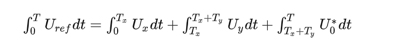

离散化后等效为下式:

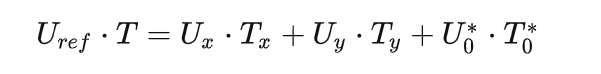

式子中的Uref是我们期望得到的电压矢量,T是一个PWM周期.
Ux和Uy分别是用于合成Uref的两个空间电压矢量,也就是上面说的6个基向量中的两个,至于是哪两个?这于与Uref所在的扇区有关,比如Uref在I扇区,呢么Ux和Uy就是U4和U6;Tx和Ty就是在一个周期T中Ux和Uy中占的时间.

U0*指的是两个零矢量,可以是U0也可以是U7,零矢量的选择比较灵活,通过合理的配置零矢量可以让空间电压矢量的切换更平顺,

所以上面公式的含义是:**我们可以周期性的在不同空间电压矢量之间切换,只要合理的配置不同基向量在一个周期中的占空比,就可以合成出等效的任意空间电压矢量了**.

SVPWM(空间电压矢量脉宽调制). 下面举一个例子,假设我们要合成图中所示Uref,在I扇区:

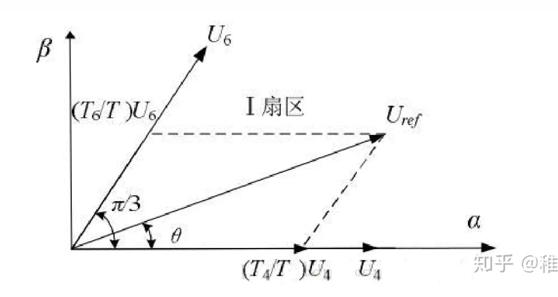

显然我们可以通过U4和U6来合成Uref,呢么如图将Uref投影分解到U4和U6的方向,由正弦定理有:

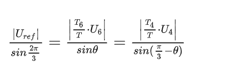

有因为|U4| = |U6| = 2/3Udc,所以可以计算得到T4和T6:

其中m为SVPWM的调制系数(即调制比):m=√3*|Uref|/Udc
> 显然在电流环控制过程中m设置的越大代表了期望力矩越大.

而零矢量分配的时间为i:T0=T7=1/2(T-T4-T6)

> 为什么T0-T7.这是将PWM波形设定为中央对齐模式对称配置零矢量的结果.

现在一个周期内所有转态的持续时间我们都得到了,还差一个顺序,也就是**各个状态切换的顺序**.

理论上任何切换顺序都是OK的,但是实际中我们需要考虑跟多限制,比如因为MOS管存在开关损耗,**我们希望能尽量减少MOS管的开关次数**,呢么以最大限度减少开关损耗为目的,我们就可以设计出下面的切换顺序:

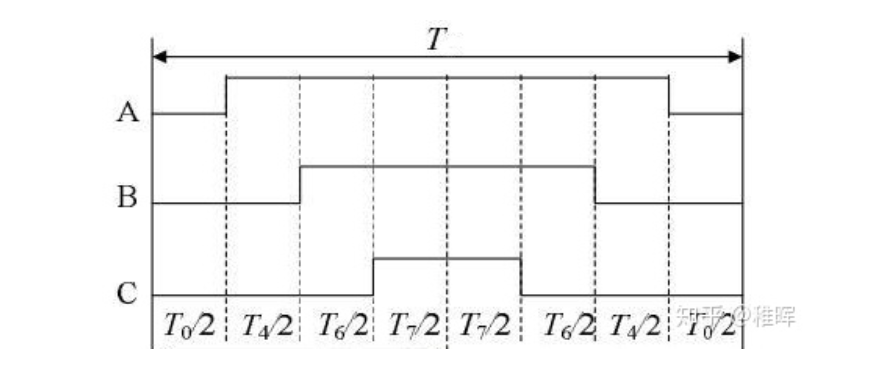

上图中可以看出来,在每个状态切换的时候,都只有一个相发生了转变:000->100->110->111->110->100->000 ,这也是所谓的七段式SVPWM调制法.
同理我们通过在合理的位置插入两个零矢量,并且对零矢量在时间上进行了平均分配,以使产生的PWM对称,从而有效的降低了PWM的谐波分量. 同理我们也可以列出在其他扇区时的切换顺序:

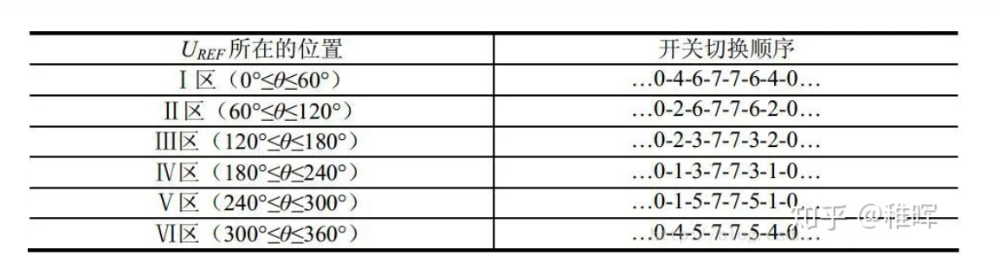

至此,SVPWM的工作完成了,我们得到了每一时刻所需要的空间电压矢量以及它们的持续时间,在处理器中赋值给对应通道的捕获比较寄存器产生相应的三个PWM波形,控制MOS管的开关,进而产生我们期望的电压,电流,力矩.
